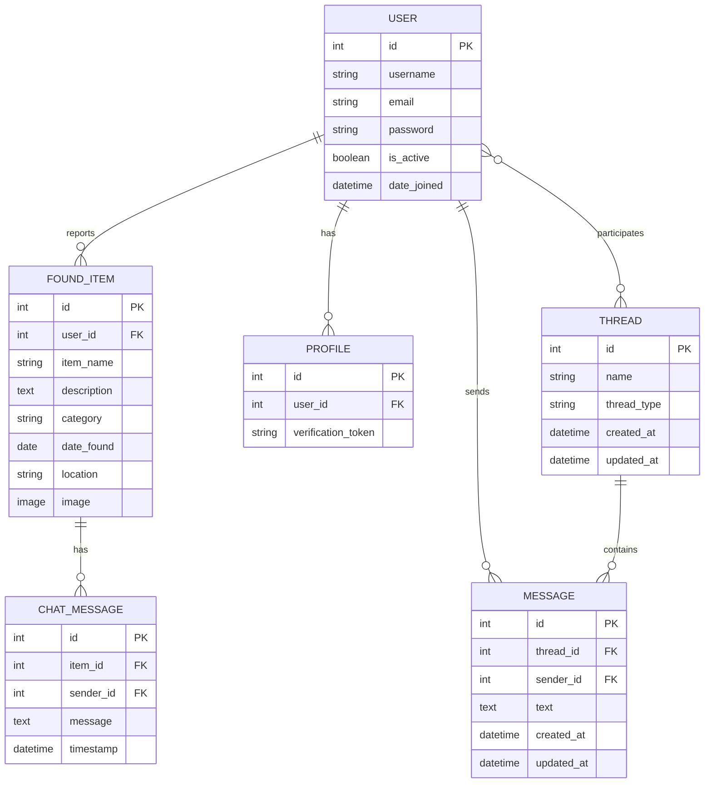

# 🔍 Lost & Found Management System

A comprehensive Django-based web application for managing lost and found items in educational institutions. This system enables students and staff to report lost items, search for found items, and communicate through real-time chat functionality.


---

## 📋 Table of Contents
- [Overview](#-overview)
- [Features](#-features)
- [Technology Stack](#-technology-stack)
- [Project Architecture](#-project-architecture)
- [Database Schema](#-database-schema)
- [Installation Guide](#-installation-guide)
- [Usage](#-usage)
- [Project Structure](#-project-structure)
- [API Endpoints](#-api-endpoints)
- [Contributing](#-contributing)
- [License](#-license)

---

## 🎯 Overview

The **Lost & Found Management System** is designed specifically for educational institutions to streamline the process of reporting and recovering lost items. The platform provides:

- **Email-verified user authentication** (College email required)
- **Item reporting system** with categories and images
- **Real-time chat** between item finders and losers
- **Advanced search and filter** capabilities
- **Responsive design** for mobile and desktop

### Why This Project?

**Problem Statement:**
- Students frequently lose items on campus (phones, wallets, documents, etc.)
- No centralized system to report or claim lost items
- Difficult to connect item finders with losers
- Manual processes are time-consuming and ineffective

**Solution:**
- Digital platform for instant reporting
- Categorized item listing for easy searching
- Real-time communication via WebSocket chat
- Email verification ensures legitimate users
- Image uploads for better item identification

---

## ✨ Features

### 🔐 Authentication & Authorization
- ✅ User registration with college email validation
- ✅ Email verification system using UUID tokens
- ✅ Secure login/logout functionality
- ✅ Session management (2-week persistence)
- ✅ Password validation with Django validators

### 📦 Item Management
- ✅ Report found items with details
- ✅ Upload item images
- ✅ Categorize items (Electronics, Documents, Clothing, Other)
- ✅ Add location and date information
- ✅ Search and filter by category
- ✅ View detailed item information

### 💬 Real-time Communication
- ✅ WebSocket-based chat system
- ✅ One-on-one messaging between users
- ✅ Thread-based conversation management
- ✅ Message history storage
- ✅ Real-time message delivery

### 👤 User Profile
- ✅ User profile management
- ✅ View reported items
- ✅ Chat history
- ✅ Account settings

---

## 🛠 Technology Stack

### Backend
```
├── Django 4.2          → Web Framework
├── Django Channels     → WebSocket Support
├── SQLite3            → Database (Development)
├── MySQL Support      → Database (Production)
└── ASGI               → Async Server Gateway
```

### Frontend
```
├── HTML5 & CSS3       → Structure & Styling
├── JavaScript         → Interactivity
└── Bootstrap          → Responsive Design
```

### Real-time Features
```
├── WebSocket          → Bidirectional Communication
├── Channels           → Django WebSocket Support
└── In-Memory Layer    → Channel Layer (Dev)
```

### Security & Email
```
├── Django Auth        → User Authentication
├── SMTP (Gmail)       → Email Verification
└── CSRF Protection    → Security Middleware
```

---

## 🏗 Project Architecture

```
┌─────────────────────────────────────────────────────────────┐
│                     CLIENT LAYER                            │
│  ┌──────────────┐  ┌──────────────┐  ┌──────────────┐     │
│  │   Browser    │  │   Mobile     │  │   Tablet     │     │
│  └──────────────┘  └──────────────┘  └──────────────┘     │
└────────────┬────────────────────────────────────────────────┘
             │
             │ HTTP/HTTPS & WebSocket
             ▼
┌─────────────────────────────────────────────────────────────┐
│                  PRESENTATION LAYER                         │
│  ┌──────────────────────────────────────────────────────┐  │
│  │            Django Templates & Static Files            │  │
│  │  • home.html  • login.html  • register.html          │  │
│  │  • CSS Files  • JavaScript  • Images                 │  │
│  └──────────────────────────────────────────────────────┘  │
└────────────┬────────────────────────────────────────────────┘
             │
             ▼
┌─────────────────────────────────────────────────────────────┐
│                   APPLICATION LAYER                         │
│  ┌────────────┐  ┌────────────┐  ┌────────────┐           │
│  │  Accounts  │  │ Found_App  │  │    Chat    │           │
│  │    App     │  │    App     │  │    App     │           │
│  └────────────┘  └────────────┘  └────────────┘           │
│  ┌────────────┐  ┌──────────────────────────────┐         │
│  │   User     │  │      URL Router              │         │
│  │    App     │  │   (lxfpro.urls)              │         │
│  └────────────┘  └──────────────────────────────┘         │
└────────────┬────────────────────────────────────────────────┘
             │
             ▼
┌─────────────────────────────────────────────────────────────┐
│                    BUSINESS LOGIC LAYER                     │
│  ┌──────────────┐  ┌──────────────┐  ┌──────────────┐     │
│  │    Views     │  │   Consumers  │  │   Managers   │     │
│  │  (HTTP)      │  │  (WebSocket) │  │  (Custom)    │     │
│  └──────────────┘  └──────────────┘  └──────────────┘     │
└────────────┬────────────────────────────────────────────────┘
             │
             ▼
┌─────────────────────────────────────────────────────────────┐
│                     DATA ACCESS LAYER                       │
│  ┌──────────────────────────────────────────────────────┐  │
│  │              Django ORM (Models)                      │  │
│  │  • User  • Profile  • FoundItem  • Thread  • Message │  │
│  └──────────────────────────────────────────────────────┘  │
└────────────┬────────────────────────────────────────────────┘
             │
             ▼
┌─────────────────────────────────────────────────────────────┐
│                      DATABASE LAYER                         │
│  ┌──────────────────────────────────────────────────────┐  │
│  │                   SQLite / MySQL                      │  │
│  │         • auth_user  • found_item                     │  │
│  │         • chat_thread  • chat_message                 │  │
│  └──────────────────────────────────────────────────────┘  │
└─────────────────────────────────────────────────────────────┘
```

---

## 📊 Database Schema



### Table Descriptions

#### 1. **User Table** (Django Default)
- Stores user authentication data
- Fields: username, email, password, is_active
- Managed by Django Auth

#### 2. **Profile Table**
- Extends User model
- Stores email verification token
- One-to-One relationship with User

#### 3. **Found_Item Table**
- Stores reported lost/found items
- Categories: Electronics, Documents, Clothing, Other
- Includes image upload capability
- Links to User (reporter)

#### 4. **Thread Table**
- Manages chat conversations
- Types: Personal (1-on-1), Group
- Many-to-Many with Users
- Tracks creation and update times

#### 5. **Message Table**
- Stores chat messages
- Links to Thread and Sender
- Timestamp tracking
- Real-time delivery via WebSocket

#### 6. **Chat_Message Table**
- Item-specific chat messages
- Links Item finder with loser
- Alternative messaging system

---

## 🚀 Quick Start - Automated Installation

### 🎯 One-Command Setup (Recommended)

The easiest way to set up the project is using our automated setup scripts:

#### **For Linux/Mac:**
```bash
# Clone the repository
git clone https://github.com/NICK-FURY-6023/dear-project-1.git
cd dear-project-1

# Run automated setup
chmod +x setup.sh
./setup.sh
```

#### **For Windows:**
```cmd
# Clone the repository
git clone https://github.com/NICK-FURY-6023/dear-project-1.git
cd dear-project-1

# Run automated setup
setup.bat
```

**The script will automatically:**
- ✅ Check Python and pip installation
- ✅ Create virtual environment
- ✅ Install all system dependencies
- ✅ Install all Python packages
- ✅ Create necessary directories
- ✅ Set up environment variables
- ✅ Run database migrations
- ✅ Create superuser (optional)
- ✅ Collect static files

### ⏱️ Manual Installation (If needed)

<details>
<summary>Click to expand manual installation steps</summary>

### Prerequisites
```bash
- Python 3.8 or higher
- pip (Python package manager)
- Git
- Virtual Environment (recommended)
```

### Step 1: Clone Repository
```bash
git clone https://github.com/NICK-FURY-6023/dear-project-1.git
cd dear-project-1
```

### Step 2: Create Virtual Environment
```bash
# Create virtual environment
python -m venv venv

# Activate virtual environment
# On Linux/Mac:
source venv/bin/activate
# On Windows:
venv\Scripts\activate
```

### Step 3: Install System Dependencies
```bash
# On Ubuntu/Debian:
sudo apt-get update
sudo apt-get install -y libjpeg-dev zlib1g-dev

# On macOS:
brew install libjpeg zlib

# On Windows:
# Usually not required, Pillow wheels include dependencies
```

### Step 4: Install Python Dependencies
```bash
pip install --upgrade pip
pip install -r requirements.txt
```

**Requirements.txt Contents:**
```
asgiref==3.7.2      # ASGI support
channels==4.0.0     # WebSocket support
Django==4.2         # Main framework
mysqlclient==2.1.1  # MySQL database driver (optional)
Pillow==9.5.0       # Image processing
sqlparse==0.4.4     # SQL parsing
tzdata==2023.3      # Timezone data
```

### Step 5: Environment Configuration

Create a `.env` file in the project root:
```bash
# Django Settings
SECRET_KEY=your-secret-key-here
DEBUG=True
ALLOWED_HOSTS=localhost,127.0.0.1

# Database Settings
DATABASE_ENGINE=django.db.backends.sqlite3
DATABASE_NAME=db.sqlite3

# Email Settings
EMAIL_BACKEND=django.core.mail.backends.smtp.EmailBackend
EMAIL_HOST=smtp.gmail.com
EMAIL_PORT=587
EMAIL_USE_TLS=True
EMAIL_HOST_USER=your-email@gmail.com
EMAIL_HOST_PASSWORD=your-app-password

# Base URL
BASE_URL=http://127.0.0.1:8000
```

### Step 6: Database Setup
```bash
# Run migrations
python manage.py makemigrations
python manage.py migrate
```

### Step 7: Create Superuser
```bash
python manage.py createsuperuser
# Follow the prompts to create admin account
```

### Step 8: Create Required Directories
```bash
mkdir -p media/lost_items
mkdir -p static/css static/js static/images
mkdir -p logs
```

### Step 9: Collect Static Files
```bash
python manage.py collectstatic --noinput
```

### Step 10: Run Development Server
```bash
python manage.py runserver
```

</details>

### 🌐 Access Application
```
🌐 Website:      http://127.0.0.1:8000/
👨‍💼 Admin Panel:  http://127.0.0.1:8000/admin/
💬 WebSocket:    ws://127.0.0.1:8000/ws/chat/
```

---

## 💻 Usage

### For Users

#### 1. **Registration**
```
1. Navigate to /register/
2. Enter username, college email, password
3. Email must end with: @vpmrzshah@gmail.com
4. Check email for verification link
5. Click verification link to activate account
```

#### 2. **Login**
```
1. Navigate to /login/
2. Enter username and password
3. Account must be verified to login
4. Session lasts for 2 weeks
```

#### 3. **Report Found Item**
```
1. Login to your account
2. Navigate to report item page
3. Fill in item details:
   - Item name
   - Description
   - Category
   - Location found
   - Date found
   - Upload image (optional)
4. Submit the report
```

#### 4. **Search Items**
```
1. Browse all found items
2. Filter by category
3. Search by keywords
4. View item details
5. Contact item reporter
```

#### 5. **Chat with Users**
```
1. Click on item you're interested in
2. Start chat with reporter
3. Real-time messaging via WebSocket
4. Discuss item details
5. Arrange item return
```

### For Administrators

#### 1. **Admin Panel Access**
```
URL: /admin/
Login with superuser credentials
```

#### 2. **Manage Users**
```
- View all registered users
- Activate/deactivate accounts
- Reset passwords
- Delete spam accounts
```

#### 3. **Manage Items**
```
- View all reported items
- Edit item details
- Delete inappropriate posts
- Monitor item status
```

#### 4. **Monitor Chats**
```
- View chat threads
- Monitor messages
- Handle disputes
```

---

## 📁 Project Structure

```
dear-project-1/
│
├── 📁 accounts/                    # Authentication & User Management
│   ├── __init__.py
│   ├── admin.py                   # Admin configurations
│   ├── apps.py                    # App configuration
│   ├── models.py                  # Profile model
│   ├── urls.py                    # URL routing
│   ├── views.py                   # Login, Register, Verify views
│   ├── 📁 templates/
│   │   ├── home.html              # Homepage
│   │   ├── login.html             # Login page
│   │   └── register.html          # Registration page
│   ├── 📁 static/css/             # Account-specific styles
│   └── 📁 migrations/             # Database migrations
│
├── 📁 chat/                        # Real-time Chat System
│   ├── __init__.py
│   ├── admin.py
│   ├── apps.py
│   ├── consumers.py               # WebSocket consumer
│   ├── managers.py                # Custom model managers
│   ├── models.py                  # Thread & Message models
│   ├── urls.py
│   ├── views.py                   # Chat views
│   ├── 📁 templates/chat/
│   └── 📁 migrations/
│
├── 📁 found_app/                   # Lost & Found Item Management
│   ├── __init__.py
│   ├── admin.py
│   ├── apps.py
│   ├── models.py                  # FoundItem & ChatMessage models
│   ├── urls.py
│   ├── views.py                   # Item CRUD operations
│   ├── 📁 templates/
│   ├── 📁 static/
│   └── 📁 migrations/
│
├── 📁 user/                        # User Profile Management
│   ├── __init__.py
│   ├── admin.py
│   ├── apps.py
│   ├── models.py
│   ├── urls.py
│   ├── views.py
│   ├── 📁 templates/
│   ├── 📁 static/
│   └── 📁 migrations/
│
├── 📁 lxfpro/                      # Project Configuration
│   ├── __init__.py
│   ├── asgi.py                    # ASGI configuration
│   ├── routing.py                 # WebSocket routing
│   ├── settings.py                # Project settings
│   ├── urls.py                    # Main URL configuration
│   └── wsgi.py                    # WSGI configuration
│
├── 📁 media/                       # User-uploaded files
│   └── lost_items/                # Item images
│
├── 📁 static/                      # Static files (CSS, JS, Images)
│
├── db.sqlite3                     # SQLite database
├── manage.py                      # Django management script
├── requirements.txt               # Python dependencies
├── README.md                      # This file
└── LICENSE                        # MIT License
```

### Key Files Explained

#### **manage.py**
```python
# Django's command-line utility
# Used for:
- Running server: python manage.py runserver
- Migrations: python manage.py migrate
- Creating superuser: python manage.py createsuperuser
```

#### **settings.py**
```python
# Core configurations:
- Installed apps
- Database settings
- Email configuration
- Static/Media file paths
- Security settings
- Channel layers
```

#### **urls.py (Main)**
```python
# URL routing configuration
urlpatterns = [
    path('admin/', admin.site.urls),      # Admin panel
    path('', include('accounts.urls')),    # Auth URLs
    path('', include('found_app.urls')),   # Item URLs
    path('', include('user.urls')),        # Profile URLs
    path('', include('chat.urls')),        # Chat URLs
]
```

#### **routing.py**
```python
# WebSocket routing
# Handles WebSocket connections for real-time chat
```

#### **consumers.py**
```python
# WebSocket consumer
# Handles:
- websocket_connect: Connection establishment
- websocket_receive: Incoming messages
- websocket_message: Message broadcasting
- websocket_disconnect: Connection closing
```

#### **models.py Files**

**accounts/models.py:**
```python
# Profile model
- Extends Django User
- Stores verification token
- One-to-One with User
```

**found_app/models.py:**
```python
# FoundItem model
- Item details (name, description, category)
- Location and date information
- Image upload
- Links to User

# ChatMessage model
- Item-specific messages
- Links sender to item owner
```

**chat/models.py:**
```python
# Thread model
- Chat conversation container
- Personal/Group types
- Many-to-Many with Users

# Message model
- Individual chat messages
- Links to Thread and Sender
- Timestamp tracking
```

---

## 🔌 API Endpoints

### Authentication Endpoints
```
GET  /                    → Home page
GET  /login/              → Login page
POST /login/              → Process login
GET  /register/           → Registration page
POST /register/           → Process registration
GET  /verify/<token>/     → Email verification
GET  /logout/             → Logout user
```

### Item Management Endpoints
```
GET  /items/              → List all items
GET  /items/<id>/         → View item details
GET  /items/add/          → Add item form
POST /items/add/          → Create new item
GET  /items/<id>/edit/    → Edit item form
POST /items/<id>/edit/    → Update item
POST /items/<id>/delete/  → Delete item
GET  /items/search/       → Search items
```

### Chat Endpoints
```
GET  /chat/               → Chat list
GET  /chat/<username>/    → Chat with user
WS   /ws/chat/<username>/ → WebSocket connection
```

### User Profile Endpoints
```
GET  /profile/            → View profile
GET  /profile/edit/       → Edit profile
POST /profile/edit/       → Update profile
GET  /profile/items/      → User's items
```

### Admin Endpoints
```
GET  /admin/              → Admin dashboard
GET  /admin/users/        → Manage users
GET  /admin/items/        → Manage items
GET  /admin/chats/        → View chats
```

---

## 🎨 Application Flow Diagrams

### User Registration Flow
```
┌─────────────┐
│   User      │
│  Visits     │
│  /register/ │
└──────┬──────┘
       │
       ▼
┌─────────────────────────┐
│  Fill Registration Form │
│  - Username             │
│  - College Email        │
│  - Password             │
└──────┬──────────────────┘
       │
       ▼
┌─────────────────────────┐
│  Email Validation       │
│  Must end with:         │
│  @vpmrzshah@gmail.com   │
└──────┬──────────────────┘
       │
       ├─── ✗ Invalid ──────┐
       │                     │
       │                     ▼
       │            ┌──────────────┐
       │            │ Show Error   │
       │            │ Message      │
       │            └──────────────┘
       │
       ✓ Valid
       │
       ▼
┌─────────────────────────┐
│  Create User Account    │
│  - is_active = False    │
│  - Generate UUID token  │
└──────┬──────────────────┘
       │
       ▼
┌─────────────────────────┐
│  Send Verification Email│
│  with token link        │
└──────┬──────────────────┘
       │
       ▼
┌─────────────────────────┐
│  User Clicks Link       │
│  /verify/<token>/       │
└──────┬──────────────────┘
       │
       ▼
┌─────────────────────────┐
│  Activate Account       │
│  - is_active = True     │
│  - Clear token          │
└──────┬──────────────────┘
       │
       ▼
┌─────────────────────────┐
│  Redirect to Login      │
│  Account Ready!         │
└─────────────────────────┘
```

### Item Reporting Flow
```
┌─────────────┐
│ Logged User │
└──────┬──────┘
       │
       ▼
┌─────────────────────────┐
│  Click "Report Item"    │
└──────┬──────────────────┘
       │
       ▼
┌─────────────────────────┐
│  Fill Item Form         │
│  - Item Name            │
│  - Description          │
│  - Category (Dropdown)  │
│  - Location             │
│  - Date Found           │
│  - Upload Image         │
└──────┬──────────────────┘
       │
       ▼
┌─────────────────────────┐
│  Validate Form          │
└──────┬──────────────────┘
       │
       ├─── ✗ Invalid ──────┐
       │                     │
       │                     ▼
       │            ┌──────────────┐
       │            │ Show Errors  │
       │            └──────────────┘
       │
       ✓ Valid
       │
       ▼
┌─────────────────────────┐
│  Process Image Upload   │
│  Save to media/         │
└──────┬──────────────────┘
       │
       ▼
┌─────────────────────────┐
│  Save to Database       │
│  - Create FoundItem     │
│  - Link to User         │
└──────┬──────────────────┘
       │
       ▼
┌─────────────────────────┐
│  Show Success Message   │
│  Redirect to Item List  │
└─────────────────────────┘
```

### Real-time Chat Flow
```
┌─────────────┐
│   User A    │
└──────┬──────┘
       │
       ▼
┌─────────────────────────┐
│  Click Chat with User B │
└──────┬──────────────────┘
       │
       ▼
┌─────────────────────────┐
│  Establish WebSocket    │
│  Connection             │
│  ws://server/chat/userB │
└──────┬──────────────────┘
       │
       ▼
┌─────────────────────────┐
│  Server: websocket      │
│  _connect()             │
│  - Get/Create Thread    │
│  - Join room/group      │
└──────┬──────────────────┘
       │
       ▼
┌─────────────────────────┐
│  Load Message History   │
│  from Thread            │
└──────┬──────────────────┘
       │
       ▼
┌─────────────────────────┐
│  User A types message   │
└──────┬──────────────────┘
       │
       ▼
┌─────────────────────────┐
│  Send via WebSocket     │
└──────┬──────────────────┘
       │
       ▼
┌─────────────────────────┐
│  Server: websocket      │
│  _receive()             │
│  - Store message in DB  │
│  - Broadcast to group   │
└──────┬──────────────────┘
       │
       ├───────────────────┬──────────────┐
       │                   │              │
       ▼                   ▼              ▼
┌──────────┐      ┌──────────┐   ┌──────────┐
│  User A  │      │  User B  │   │ Database │
│ Receives │      │ Receives │   │  Stores  │
└──────────┘      └──────────┘   └──────────┘
```

---

## 🔒 Security Features

### 1. **Authentication Security**
- Password hashing using Django's PBKDF2
- Session-based authentication
- CSRF protection on all forms
- Email verification required

### 2. **Data Validation**
- Form validation on client and server side
- Email format validation
- File upload validation (size, type)
- SQL injection protection (Django ORM)

### 3. **Session Management**
- Secure session cookies
- 2-week session expiry
- Logout functionality
- Session hijacking prevention

### 4. **File Upload Security**
- Restricted file types (images only)
- File size limitations
- Secure file storage location
- Sanitized file names

---

## 🧪 Testing

### Run Tests
```bash
# Run all tests
python manage.py test

# Run specific app tests
python manage.py test accounts
python manage.py test chat
python manage.py test found_app

# Run with coverage
coverage run --source='.' manage.py test
coverage report
```

---

## 🚀 Production Deployment

### 📋 Pre-Deployment Checklist

Before deploying to production, ensure you complete all these steps:

#### 1. **Environment Configuration**

Create/Update `.env` file:
```bash
# Production Settings
SECRET_KEY=your-very-secure-random-key-here
DEBUG=False
ALLOWED_HOSTS=yourdomain.com,www.yourdomain.com

# Database (PostgreSQL/MySQL)
DATABASE_ENGINE=django.db.backends.postgresql
DATABASE_NAME=lostfound_db
DATABASE_USER=db_user
DATABASE_PASSWORD=secure_password
DATABASE_HOST=localhost
DATABASE_PORT=5432

# Email (Production SMTP)
EMAIL_HOST=smtp.gmail.com
EMAIL_PORT=587
EMAIL_USE_TLS=True
EMAIL_HOST_USER=your-production-email@gmail.com
EMAIL_HOST_PASSWORD=your-app-password

# Security
SESSION_COOKIE_SECURE=True
CSRF_COOKIE_SECURE=True
SECURE_SSL_REDIRECT=True

# Base URL
BASE_URL=https://yourdomain.com
```

#### 2. **Database Setup (PostgreSQL)**

```bash
# Install PostgreSQL
sudo apt-get install postgresql postgresql-contrib

# Create database and user
sudo -u postgres psql
CREATE DATABASE lostfound_db;
CREATE USER db_user WITH PASSWORD 'secure_password';
ALTER ROLE db_user SET client_encoding TO 'utf8';
ALTER ROLE db_user SET default_transaction_isolation TO 'read committed';
ALTER ROLE db_user SET timezone TO 'UTC';
GRANT ALL PRIVILEGES ON DATABASE lostfound_db TO db_user;
\q

# Install PostgreSQL adapter
pip install psycopg2-binary
```

#### 3. **Redis Setup (for WebSocket)**

```bash
# Install Redis
sudo apt-get install redis-server

# Start Redis
sudo systemctl start redis
sudo systemctl enable redis

# Install Redis channels
pip install channels-redis

# Update settings.py
CHANNEL_LAYERS = {
    "default": {
        "BACKEND": "channels_redis.core.RedisChannelLayer",
        "CONFIG": {
            "hosts": [("127.0.0.1", 6379)],
        },
    },
}
```

#### 4. **Web Server Setup (Nginx + Gunicorn)**

**Install Gunicorn & Daphne:**
```bash
pip install gunicorn daphne
```

**Gunicorn configuration** (`gunicorn_config.py`):
```python
bind = "127.0.0.1:8000"
workers = 3
worker_class = "sync"
timeout = 120
accesslog = "logs/gunicorn_access.log"
errorlog = "logs/gunicorn_error.log"
loglevel = "info"
```

**Daphne configuration** (for WebSocket):
```bash
daphne -b 127.0.0.1 -p 8001 lxfpro.asgi:application
```

**Nginx configuration** (`/etc/nginx/sites-available/lostfound`):
```nginx
upstream django {
    server 127.0.0.1:8000;
}

upstream websocket {
    server 127.0.0.1:8001;
}

server {
    listen 80;
    server_name yourdomain.com www.yourdomain.com;
    return 301 https://$server_name$request_uri;
}

server {
    listen 443 ssl http2;
    server_name yourdomain.com www.yourdomain.com;

    ssl_certificate /path/to/ssl/cert.pem;
    ssl_certificate_key /path/to/ssl/key.pem;

    client_max_body_size 10M;

    location / {
        proxy_pass http://django;
        proxy_set_header X-Forwarded-For $proxy_add_x_forwarded_for;
        proxy_set_header X-Forwarded-Proto $scheme;
        proxy_set_header Host $host;
        proxy_redirect off;
    }

    location /ws/ {
        proxy_pass http://websocket;
        proxy_http_version 1.1;
        proxy_set_header Upgrade $http_upgrade;
        proxy_set_header Connection "upgrade";
        proxy_set_header Host $host;
        proxy_set_header X-Real-IP $remote_addr;
        proxy_set_header X-Forwarded-For $proxy_add_x_forwarded_for;
        proxy_set_header X-Forwarded-Proto $scheme;
    }

    location /static/ {
        alias /path/to/your/project/staticfiles/;
    }

    location /media/ {
        alias /path/to/your/project/media/;
    }
}
```

**Enable site:**
```bash
sudo ln -s /etc/nginx/sites-available/lostfound /etc/nginx/sites-enabled/
sudo nginx -t
sudo systemctl restart nginx
```

#### 5. **SSL Certificate (Let's Encrypt)**

```bash
# Install Certbot
sudo apt-get install certbot python3-certbot-nginx

# Get SSL certificate
sudo certbot --nginx -d yourdomain.com -d www.yourdomain.com

# Auto-renewal
sudo certbot renew --dry-run
```

#### 6. **Systemd Services**

**Gunicorn Service** (`/etc/systemd/system/lostfound.service`):
```ini
[Unit]
Description=Lost & Found Gunicorn Daemon
After=network.target

[Service]
User=www-data
Group=www-data
WorkingDirectory=/path/to/your/project
EnvironmentFile=/path/to/your/project/.env
ExecStart=/path/to/your/project/venv/bin/gunicorn \
          --config gunicorn_config.py \
          lxfpro.wsgi:application

[Install]
WantedBy=multi-user.target
```

**Daphne Service** (`/etc/systemd/system/lostfound-ws.service`):
```ini
[Unit]
Description=Lost & Found Daphne WebSocket
After=network.target

[Service]
User=www-data
Group=www-data
WorkingDirectory=/path/to/your/project
EnvironmentFile=/path/to/your/project/.env
ExecStart=/path/to/your/project/venv/bin/daphne \
          -b 127.0.0.1 -p 8001 \
          lxfpro.asgi:application

[Install]
WantedBy=multi-user.target
```

**Enable and start services:**
```bash
sudo systemctl daemon-reload
sudo systemctl start lostfound
sudo systemctl start lostfound-ws
sudo systemctl enable lostfound
sudo systemctl enable lostfound-ws
```

#### 7. **Static & Media Files**

```bash
# Collect static files
python manage.py collectstatic --noinput

# Set permissions
sudo chown -R www-data:www-data /path/to/your/project/
sudo chmod -R 755 /path/to/your/project/staticfiles/
sudo chmod -R 755 /path/to/your/project/media/
```

#### 8. **Security Hardening**

Update `settings.py`:
```python
# Security Settings
DEBUG = False
ALLOWED_HOSTS = ['yourdomain.com', 'www.yourdomain.com']

# HTTPS/SSL
SECURE_SSL_REDIRECT = True
SESSION_COOKIE_SECURE = True
CSRF_COOKIE_SECURE = True
SECURE_BROWSER_XSS_FILTER = True
SECURE_CONTENT_TYPE_NOSNIFF = True
X_FRAME_OPTIONS = 'DENY'

# HSTS
SECURE_HSTS_SECONDS = 31536000
SECURE_HSTS_INCLUDE_SUBDOMAINS = True
SECURE_HSTS_PRELOAD = True
```

#### 9. **Monitoring & Logging**

**Setup logging** (`settings.py`):
```python
LOGGING = {
    'version': 1,
    'disable_existing_loggers': False,
    'formatters': {
        'verbose': {
            'format': '{levelname} {asctime} {module} {message}',
            'style': '{',
        },
    },
    'handlers': {
        'file': {
            'level': 'ERROR',
            'class': 'logging.handlers.RotatingFileHandler',
            'filename': 'logs/django_errors.log',
            'maxBytes': 1024*1024*15,  # 15MB
            'backupCount': 10,
            'formatter': 'verbose',
        },
    },
    'root': {
        'handlers': ['file'],
        'level': 'ERROR',
    },
}
```

#### 10. **Database Backup**

Create backup script (`backup.sh`):
```bash
#!/bin/bash
BACKUP_DIR="/path/to/backups"
DATE=$(date +%Y%m%d_%H%M%S)
pg_dump -U db_user lostfound_db > "$BACKUP_DIR/backup_$DATE.sql"
find $BACKUP_DIR -type f -mtime +7 -delete
```

Add to crontab:
```bash
0 2 * * * /path/to/backup.sh
```

### 🐳 Docker Deployment (Alternative)

Create `Dockerfile`:
```dockerfile
FROM python:3.10-slim

ENV PYTHONUNBUFFERED=1
WORKDIR /app

RUN apt-get update && apt-get install -y \
    libjpeg-dev zlib1g-dev postgresql-client \
    && rm -rf /var/lib/apt/lists/*

COPY requirements.txt .
RUN pip install --no-cache-dir -r requirements.txt

COPY . .

RUN python manage.py collectstatic --noinput

EXPOSE 8000

CMD ["gunicorn", "--config", "gunicorn_config.py", "lxfpro.wsgi:application"]
```

Create `docker-compose.yml`:
```yaml
version: '3.8'

services:
  db:
    image: postgres:13
    environment:
      POSTGRES_DB: lostfound_db
      POSTGRES_USER: db_user
      POSTGRES_PASSWORD: secure_password
    volumes:
      - postgres_data:/var/lib/postgresql/data

  redis:
    image: redis:6-alpine

  web:
    build: .
    command: gunicorn --config gunicorn_config.py lxfpro.wsgi:application
    volumes:
      - ./media:/app/media
      - ./staticfiles:/app/staticfiles
    ports:
      - "8000:8000"
    depends_on:
      - db
      - redis
    env_file:
      - .env

  websocket:
    build: .
    command: daphne -b 0.0.0.0 -p 8001 lxfpro.asgi:application
    depends_on:
      - db
      - redis
    env_file:
      - .env

  nginx:
    image: nginx:alpine
    ports:
      - "80:80"
      - "443:443"
    volumes:
      - ./nginx.conf:/etc/nginx/conf.d/default.conf
      - ./staticfiles:/static
      - ./media:/media
    depends_on:
      - web

volumes:
  postgres_data:
```

**Deploy with Docker:**
```bash
docker-compose up -d
docker-compose exec web python manage.py migrate
docker-compose exec web python manage.py createsuperuser
```

### 📊 Performance Optimization

1. **Enable Caching:**
```python
CACHES = {
    'default': {
        'BACKEND': 'django_redis.cache.RedisCache',
        'LOCATION': 'redis://127.0.0.1:6379/1',
    }
}
```

2. **Database Optimization:**
```python
CONN_MAX_AGE = 600  # Keep connections alive
```

3. **Compress Static Files:**
```bash
pip install django-compressor
```

### 🔍 Monitoring Tools

- **Sentry** - Error tracking
- **New Relic** - Performance monitoring
- **Prometheus + Grafana** - Metrics
- **ELK Stack** - Logging

---

## 📱 Platform-Specific Deployments

### Heroku Deployment

1. **Install Heroku CLI**
2. **Create Procfile:**
```
web: gunicorn lxfpro.wsgi
worker: daphne lxfpro.asgi:application --port $PORT --bind 0.0.0.0
```
3. **Deploy:**
```bash
heroku create your-app-name
heroku addons:create heroku-postgresql:hobby-dev
heroku addons:create heroku-redis:hobby-dev
git push heroku main
heroku run python manage.py migrate
```

### AWS Deployment

- Use **EC2** for server
- **RDS** for PostgreSQL
- **ElastiCache** for Redis
- **S3** for media files
- **CloudFront** for CDN
- **Route 53** for DNS

### DigitalOcean Deployment

- Use **Droplet** for server
- **Managed Database** for PostgreSQL
- **Managed Redis**
- **Spaces** for media storage

---

## 🤝 Contributing

Contributions are welcome! Please follow these steps:

1. Fork the repository
2. Create a feature branch (`git checkout -b feature/AmazingFeature`)
3. Commit your changes (`git commit -m 'Add some AmazingFeature'`)
4. Push to the branch (`git push origin feature/AmazingFeature`)
5. Open a Pull Request

### Coding Standards
- Follow PEP 8 style guide
- Write meaningful commit messages
- Add comments for complex logic
- Update documentation
- Write tests for new features

---

## 📝 License

This project is licensed under the MIT License - see the [LICENSE](LICENSE) file for details.

---

## 👥 Authors

- **NICK-FURY-6023** - *Initial work* - [GitHub Profile](https://github.com/NICK-FURY-6023)

---

## 🙏 Acknowledgments

- Django Documentation
- Django Channels Documentation
- Bootstrap Framework
- Stack Overflow Community
- GitHub Community

---

## 📧 Contact & Support

For queries and support:
- **GitHub Issues**: [Create an issue](https://github.com/NICK-FURY-6023/dear-project-1/issues)
- **Email**: lostandfound.vpmrzshah@gmail.com

---

## 📈 Future Enhancements

- [ ] Mobile app (React Native/Flutter)
- [ ] Push notifications
- [ ] Advanced search with AI
- [ ] Item matching algorithm
- [ ] Multi-language support
- [ ] Analytics dashboard
- [ ] Export reports (PDF/Excel)
- [ ] Integration with college ID system
- [ ] QR code for item tracking
- [ ] Reward system for finders

---

## 📊 Statistics

```
Total Lines of Code: ~5000+
Apps: 4 (accounts, chat, found_app, user)
Models: 6
Views: 15+
Templates: 10+
WebSocket Consumers: 1
```

---

**Made with ❤️ for the student community**

*Last Updated: October 6, 2025*